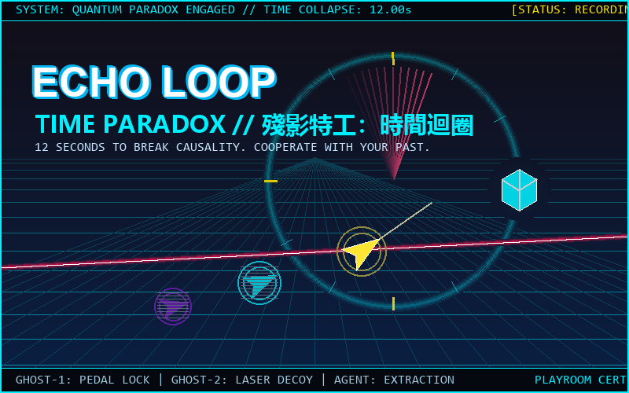

# 殘影特工：時間迴圈 (Echo Loop: Time Paradox)



12 秒極限時間迴圈潛入！操控特工並精確錄製軌跡，與上一輪半透明的自己跨時空協同開門、避開雷射、奪取量子核心！

## 遊戲特色
- **12 秒極限倒計時**：精準的時間管理與路徑規劃。
- **殘影協同機制**：每一輪特工的軌跡都會在下一輪作為半透明量子殘影 1:1 重現，協助踩壓踏板、開啟閘門、引開雷射。
- **純 Web Audio API 程式化音效與 BGM**：零外部大型音訊資產，秒開秒玩。
- **純 HTML5 Canvas 2D 霓虹發光渲染**：賽博龐克風格、時間倒流負片掃描特效、粒子特效。
- **Playroom SDK 規範原生整合**：支援成績紀錄、排行、進度保存與跨平台響應式佈局。

## 鍵盤與觸控操作
- **移動**：`W / A / S / D` 或方向鍵 / 螢幕虛擬搖桿
- **時空衝刺 (Blink Dash)**：`Space` 或右側衝刺按鈕
- **時間重置 (Rewind)**：`R` 鍵或右側回溯按鈕

## 本地開發與構建
```bash
npm install
npm run dev
npm run build
```
